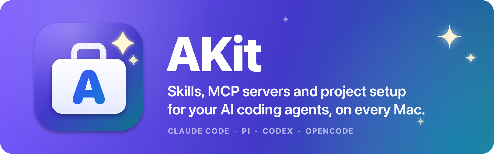
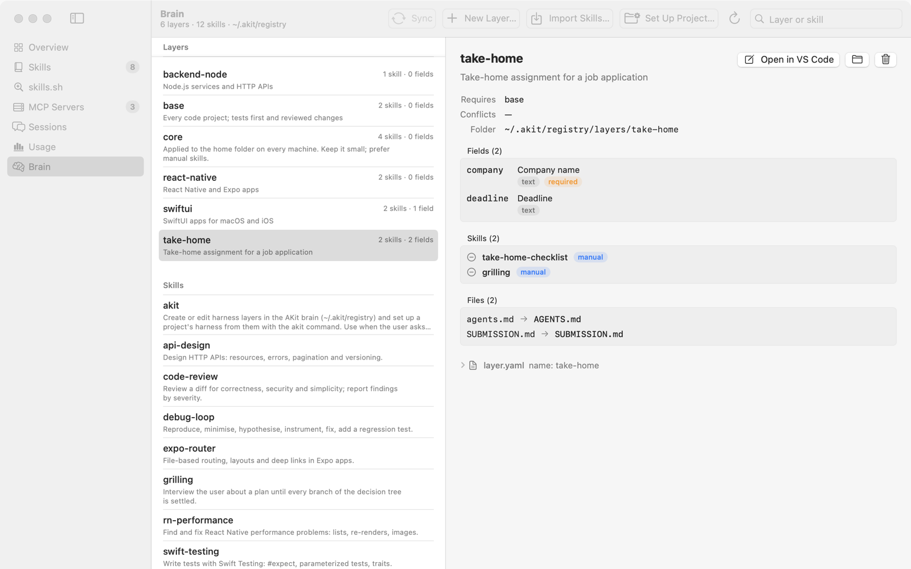
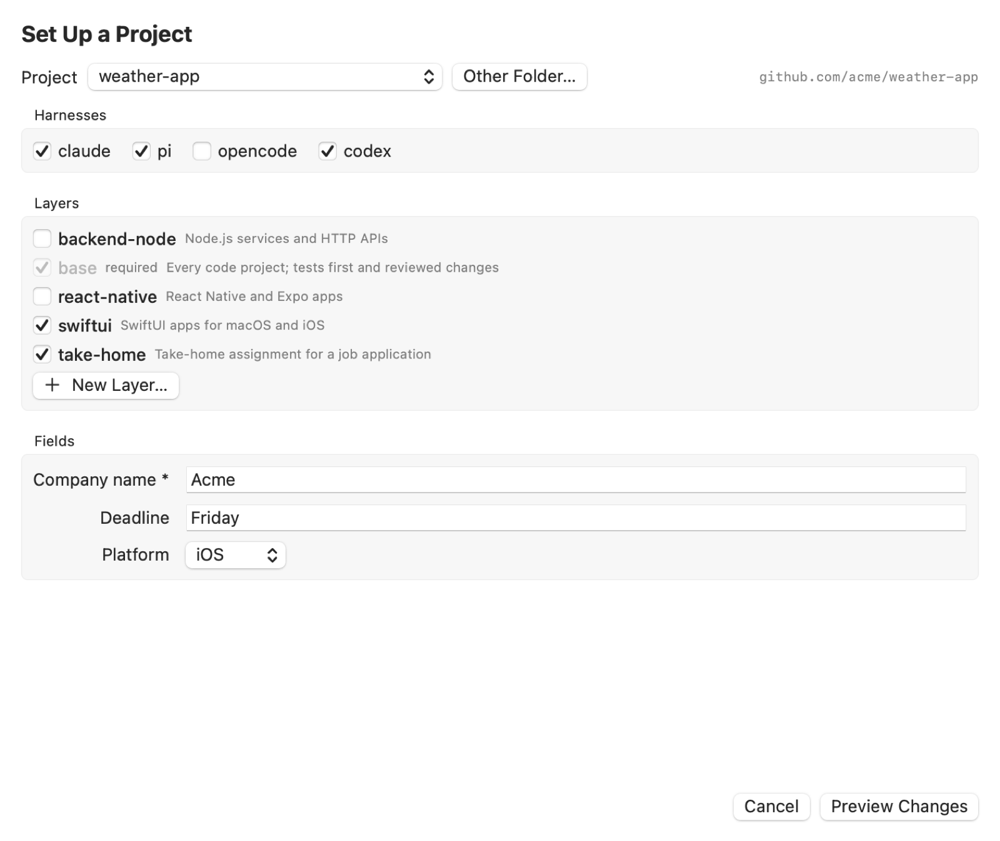

<p align="center">
  
</p>

<p align="center">
  
  
  
  <a href="LICENSE"></a>
</p>

<p align="center">
  <a href="#install"><b>Install</b></a> ·
  <a href="#the-app"><b>The app</b></a> ·
  <a href="#the-brain"><b>The brain</b></a> ·
  <a href="#everyday-use"><b>Everyday use</b></a> ·
  <a href="#akit-reference"><b>akit reference</b></a>
</p>

**AKit** stands for **Agent Kit**: the kit your AI coding agents work with (their skills,
MCP servers, rules and settings), kept in one place and packed the same way for every
project and every Mac.

AKit is a native macOS app and command line for people who work with several AI coding
agents (Claude Code, Pi, Codex, OpenCode). It shows everything the agents are set up with in
one place (skills, MCP servers, sessions, usage), and it sets up agents per project from
your own **brain**: a private git repo of skills and composable layers that follows you to
every Mac.

<p align="center">
  <picture>
    <source media="(prefers-color-scheme: dark)" srcset="docs/assets/brain-dark.png">
    
  </picture>
</p>

- **See** what each agent loads: skills, MCP servers, sessions, tokens and cost.
- **Set up a project in one step:** pick layers (`swiftui`, `take-home`, …), answer their
  questions, review the diff, apply. Every agent gets the same skills and `AGENTS.md`.
- **Keep one setup on every Mac:** the brain is a git repo; `akit sync` or the Sync button
  moves changes between Macs.
- **Let your agent do it:** the `/akit` skill drives the `akit` command, so "set up this
  project" or "make a layer for React Native apps" is one request.

## Install

```sh
/bin/bash -c "$(curl -fsSL https://raw.githubusercontent.com/Stanislavussov/akit/master/install.sh)"
```

> **❗ On a work Mac, run it with `AKIT_MACHINE=work` the first time:**
>
> ```sh
> AKIT_MACHINE=work /bin/bash -c "$(curl -fsSL https://raw.githubusercontent.com/Stanislavussov/akit/master/install.sh)"
> ```
>
> It must be set before anything is saved: it keeps that Mac's project records out of your
> brain (see [A work Mac](#a-work-mac)). A plain install on a work Mac is a personal one.

Needs macOS 15 or later and git (`xcode-select --install` if it's missing). The script
downloads the latest release into `~/Applications/AKit.app` and `~/.local/bin/akit` (no
Xcode needed), adds `~/.local/bin` to your PATH, and starts `akit setup`, which asks a few
questions. Enter takes the default each time:

1. **Your brain.** Type the repo you use on your other Macs (`you/brain` or a git URL),
   or press Enter to start a new one. A new brain begins with a `core` layer holding the
   `/akit` skill. With the GitHub CLI signed in (`gh auth login`), setup offers to put it
   in a private GitHub repo right away.
2. **Your projects folder** (default `~/Projects`), shared with the app's Settings.
3. **A `~/.claude/skills` folder of your own**, if you have one: moved into
   `~/.agents/skills` (backed up) so every agent reads the same skills. Asked, never
   done silently.
4. **Skills already in `~` that differ from the brain's:** kept unless you say replace
   (the old files are backed up).
5. **Session capture** (Claude plugin, Pi extension, hourly import), asked once; a no is
   remembered (`akit insights install --yes` turns it on later). Later runs keep the parts
   that are there up to date without asking, and ask once before adding a new one (say
   Claude Code, installed since). `--skip-home` skips capture too.

Then the brain's core layer goes into your home folder for every agent on the Mac. That's
it: open a project and ask your agent `/akit set up this project`.

Run the install again to update. `akit setup` is safe to run again any time: it syncs the
brain, adds agents installed since, and puts new core skills into `~`. After an update,
restart Pi (or run `/reload` in it): a running Pi keeps the old extension.

> [!IMPORTANT]
> **Rating a Pi run** (Pi 0.80.4 or newer) uses Option keys: after a run, ⌥G rates it good, ⌥X bad, ⌥R with a
> comment. Until your next prompt the same keys change the rating or its comment, and ⌥U
> removes it. Your terminal must send Option as Meta (iTerm2: Profiles → Keys → Left Option
> key: Esc+; Terminal: Settings → Profiles → Keyboard → Use Option as Meta key). The ratings
> show on the Sessions screen, after the run they rate; the model never sees them.

**Settings for scripts:** `AKIT_BRAIN_REPO=you/brain` answers the brain question,
`AKIT_SKIP_HOME=1` leaves `~` alone, `AKIT_FROM_SOURCE=1` builds from source,
`AKIT_MACHINE=work` marks a work Mac (see below). Without a
terminal (CI), every default is taken.

## The app

| Screen | What it does |
| --- | --- |
| **Overview** | Which agents are installed, their versions and where their configs live. Agents AKit doesn't know yet can be described in a form. |
| **Skills** | Every skill the agents can see, grouped by where it lives (global, per project, plugins, claude.ai), with filters by project and agent. |
| **skills.sh** | Search the public [skills.sh](https://skills.sh) directory, preview a skill and install it into one folder you choose, as is or as your own copy. |
| **MCP Servers** | Every configured MCP server per agent and project. Add one from a form, pasted JSON or the public catalogs (Anthropic's directory, the MCP Registry), edit or delete it; secret values go to the Keychain, never into config files and never on screen. |
| **Sessions** | Saved conversations of every agent, newest first, with token use. Copy one as Markdown or JSON for evals or another agent. A Claude Code session also gets an Analysis tab (calls, fresh tokens, where the context went, friction, commits) and a button to have an agent review it. |
| **Usage** | Tokens and cost per day and subscription, from the agents' own session files. Only what they recorded; the one exception, Claude Code sessions that saved no cost, is marked as an estimate. |
| **Error Analysis** | Finds what goes wrong across many sessions: a model writes blind notes per session (checked by a verifier), you label a bootstrap set, notes are grouped into failure modes, and each mode's frequency comes from a code check or a validated judge, with intervals. Fixes are judged before/after and on control tasks. Session data goes only where Settings → Lab allows. |
| **Lab** | Measures agent sessions. Runs start in an Orca or herdr tab (or in the background), one at a time: an agent reviews a session, or redoes a commit from its parent in an isolated clone under different setups while the commit's own tests judge it. Numbers come from the transcript and git, never from the agent. |
| **Brain** | Your layers and skill library: create and edit layers, add skills to them, import skills, set up a project, remove things, sync with the remote. |

AKit only reads agent files unless you apply a change. Every change shows a diff first,
replaced files are backed up in `~/.akit/backups`, and removed files go to the Trash.

## The brain

The brain is an ordinary git repo in `~/.akit/registry`. No agent reads it; AKit renders
from it into projects and your home folder. Nothing in it ships with AKit: it's yours, and
it should stay private (it records your projects).

```
skills/<name>/SKILL.md          skill library, one copy of each skill
layers/<name>/layer.yaml        a layer: questions, skills, files
layers/<name>/templates/        files a layer puts into projects (AGENTS.md sections, scripts, configs)
projects/<id>/answers.json      what each project chose (written by akit)
projects/<id>/lock.json         what was written there and from which brain commit
```

### Layers

A layer is one reusable piece of setup. A project picks several; they add up.

```yaml
name: take-home
description: Take-home assignment for a job application
requires: [base]                # always comes with base, rendered after it
conflicts: []
fields:                         # questions asked when a project picks the layer
  - id: company
    prompt: Company name
    type: text                  # text | bool | choice | multi
    required: true
  - id: stack
    type: choice
    options: [node, swift]
    default: node
skills:
  - name: grilling
    mode: manual                # manual: only when you type /grilling
  - tdd                         # auto: the agent uses it when it fits
files:
  - template: agents.md
    to: AGENTS.md               # sections from several layers are joined in layer order
  - template: review.md
    to: REVIEW.md
    when: stack == node         # only for some answers
```

Templates can use `{{company}}`, `{{project_name}}` and `{{target}}`. Skills stay in
`skills/`; a layer only lists them, so one skill can serve many layers.

### What a project gets

`akit apply` (or Set Up Project in the app, or `/akit`) writes:

- `.agents/skills/<name>/`: the chosen skills, read by Pi, Codex and OpenCode;
- `.claude/skills`: a link to `.agents/skills`, so Claude Code reads the same skills;
- `AGENTS.md` from the layers' sections (when they have any), and a `CLAUDE.md` that points Claude Code at it;
- any other files the layers bring.

Applying again updates exactly what changed in the brain. Files you edited by hand, or that
AKit didn't write, are left alone unless you say otherwise. Layers are only a starting point:
AGENTS.md and the other files they bring become the project's own once you edit them, and
a newer layer version is only offered. A project can also take extra brain skills (or turn a
layer's skill off) and keep skills of its own in `.agents/skills`, which AKit never overwrites. Commit the result in the project,
so it also works for people without AKit.

### The core layer and your home folder

`core` is the one layer that goes into `~` instead of a project, so its skills are there in
every project on the Mac. Keep it small and prefer manual skills, so agents don't load
what they don't need. `akit setup` or `akit apply --home` puts it in place.

### More than one Mac

```sh
akit sync                        # or Sync on the Brain screen
```

Sync brings in the other Macs' commits and pushes this Mac's. If both sides changed the same
lines, nothing is changed and you're told which files to merge. Uncommitted edits are never
synced or lost. The Sync button shows what's waiting (`↑2` to push, `↓1` to pull). When
the core layer changed, run `akit apply --home` (or `akit setup`).

Created a brain without a remote? Push it to a private repo once:

```sh
git -C ~/.akit/registry remote add origin git@github.com:you/brain.git
git -C ~/.akit/registry push -u origin HEAD
```

On another Mac, answer `you/brain` when the install asks.

### A work Mac

The brain goes to your personal remote, and `projects/` names every project you set up.
On a computer whose projects must not end up there, run `akit machine work` (or Settings →
This Mac → Work, or `AKIT_MACHINE=work` on install) before setting anything up. Answers and
locks of its projects then stay in `~/.akit/local/projects` and are never committed; the
home folder's record is named `work` instead of the host name. Skills and layers still come
from the brain. `akit machine` shows the current role; a broken `~/.akit/machine.json`
counts as work.

Projects on a work Mac are local only by default (`--local-only yes|no` changes it per
project): AKit's files stay out of git through a block in the repository's
`.git/info/exclude`, and every other git worktree of the repository gets links to them
(`akit worktrees sync`, which a worktree tool's hook can run). When something doesn't work,
`akit doctor` shows what AKit sees.

## Everyday use

**With your agent** (Claude Code, Pi, …): `/akit` followed by what you want.

- `/akit set up this project`: reads the project, suggests layers, asks what the layers
  need to know, shows the plan and applies it after your yes.
- `/akit make a layer for React Native apps with the vercel-react-native-skills skill`
- `/akit add the tdd skill to the take-home layer`
- `/akit remove the old-review skill from the brain`

<p align="center">
  <picture>
    <source media="(prefers-color-scheme: dark)" srcset="docs/assets/setup-dark.png">
    
  </picture>
</p>

**In the app:** Brain → Set Up Project… (pick a folder, tick layers, fill fields, see every
change as a diff, Apply), New Layer…, Import Skills… (copies skills from `~/.agents/skills`
into the brain), and the trash buttons on layers and skills. On a layer: Add Skills…, a mode
menu per skill (auto, manual, off), and Edit… for its description, requires and AGENTS.md
section. On a brain skill: Add to Layer. Every change is committed to the brain.

**In a terminal:**

```sh
cd ~/Projects/my-app
akit plan --layers swiftui               # what would change, with diffs; writes nothing
akit apply --layers swiftui              # do it
akit apply --set company=Acme            # change one answer, keep the rest
```

## akit reference

```
akit setup [--repo REPO] [--yes] [--skip-home]   the install questions (safe to rerun)
akit init                                        create a brain
akit sync                                        pull and push the brain

akit check                                       problems in layers and skills (exit 1 if any)
akit layers [--json]                             layers with their fields, skills and files
akit skills                                      skills in the brain

akit answers [PROJECT]                           a project's saved answers
akit plan  [PROJECT] [ANSWERS]                   what would change, with diffs
akit apply [PROJECT] [ANSWERS] [--include PATH] [--exclude PATH] [--include-unmanaged]
akit plan --home / akit apply --home             the core layer into ~

akit remove layer NAME                           refused while other layers require it
akit remove skill NAME [--from LAYER]            from the brain, or only from one layer
akit remove project [PROJECT|--home] [--keep-files]

akit worktrees [sync] [PROJECT]                  a local-only project's files linked into its git worktrees
akit machine [work [--name NAME] | personal]     a work Mac keeps project records out of the brain
akit doctor                                      what AKit sees on this Mac and what is wrong (read-only)

akit lab analyze SESSION                         metrics of one Claude Code session
akit lab new review SESSION [--harness pi] [--model M]
                                                 a model (through Claude Code or Pi) reviews a
                                                 session: one paragraph and up to 3 generic
                                                 improvements with evidence (--language ru|cs)
akit lab new replay COMMIT [--setups full,lean] [--repeats N]
                                                 redo a commit under setups; hidden tests judge it
akit lab list / show ID / compare COMMIT         runs and their results
akit lab policy / sends                          where session data may go; what was sent, at what cost

akit lab new analysis [--project P] [--size N] [--yes]
                                                 error analysis over a sample of sessions (shows the
                                                 ≈ cost first; --yes queues it)
akit analysis notes / modes / queue / report     notes per session, failure modes, what waits for you,
                                                 frequencies with intervals and the transition matrix
akit analysis bootstrap …                        label 30+ sessions yourself; recall of the model's notes
akit analysis fix … / control …                  fix drafts, before/after, controlled evals on fixed tasks

ANSWERS: --layers a,b  --set field=value  --unset field  --targets claude,pi  --answers FILE
         --local-only yes|no|auto
```

`PROJECT` defaults to the current folder. `remove` shows what it would do and needs `--yes`
to do it. `--brain DIR` uses another brain folder; `AKIT_PROJECTS_ROOT` overrides the
projects folder. `akit --help` has the details.

## Where things live

| Path | What |
| --- | --- |
| `~/Applications/AKit.app`, `~/.local/bin/akit` | the app and the command |
| `~/.akit/registry` | your brain |
| `~/.akit/backups/<time>/` | every file AKit replaced, by path under `~` |
| `~/.akit/machine.json`, `~/.akit/local/projects/` | this Mac's role; on a work Mac, its project records |
| `~/.akit/lab/` | Lab runs (one folder each) and checked replay tasks |
| `~/.akit/lab/analysis/` | error analysis: modes (a local git repo), notes, checks, labels, batches, the send log |
| `~/.akit/lab/evals/` | control tasks |
| `~/.agents/skills`, `~/.claude/skills` | skills from the core layer (the second links to the first) |
| Keychain | MCP secret values you entered in AKit |

To uninstall, delete the app and `~/.local/bin/akit`. Your brain, backups and the skills
already rendered stay where they are.

## Build from source

Needs Xcode and [XcodeGen](https://github.com/yonaskolb/XcodeGen) (`brew install xcodegen`).

```sh
git clone https://github.com/Stanislavussov/akit && cd akit
./install.sh            # build and install, then akit setup
make run                # debug build and launch
make test               # core tests (Swift Testing, in a temporary fake home)
make install-cli        # only the akit command
make release            # dist/AKit.zip (universal app + akit) for a GitHub release
make screenshots        # README screenshots from a made-up home (tools/demo-home.sh)
make banner             # redraw docs/assets/banner.png
```

The logic lives in the Swift package in `AKitCore/`, split into one module per area
(harnesses, skills, sessions, usage, MCP, brain, insights, render, project setup, lab,
the `akit` command); `docs/design/architecture.md` shows the modules and how they depend on
each other. The app in `AKit/` is SwiftUI on top of them. See `CLAUDE.md` for the project
rules and `docs/design/layers.md` for the brain and layers design.

## License

MIT, see [LICENSE](LICENSE).
